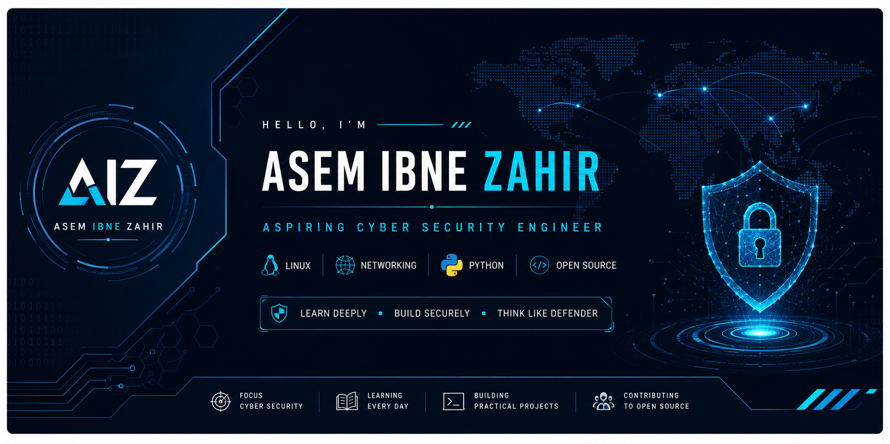

<div align="center">



# Asem Ibne Zahir

### Aspiring Cyber Security Engineer

<p>
<a href="https://github.com/asemibnezahir">

</a>

<a href="mailto:asemibnezahir@gmail.com">

</a>

<a href="https://www.linkedin.com/in/asem-ibne-zahir/">

</a>

</p>


</div>

---

## 💻 whoami

```bash
┌──(asem㉿security)-[~]
└─$ whoami

Name      : Asem Ibne Zahir
Role      : Aspiring Cyber Security Engineer
Focus     : Linux • Networking • Python
University: Daffodil International University
Mission   : Build secure systems through continuous learning.
```
